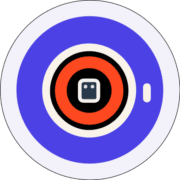

#  All Images Ai

Generate AI images from text prompts using Midjourney AI, producing 4 image proposals per generation. Supports simple mode with configurable parameters (aspect ratio, weather, time of day, camera model, chaos, stylization, exclusions) and advanced mode for raw Midjourney prompts. Search and download AI-generated stock images by keyword, purchase images with credits, and retrieve multiple resolution versions (preview, full, upscale, UHD). Track asynchronous generation status, retry failed generations, manage API keys, and configure webhooks for generation lifecycle events (created, active, progress, completed, failed).

## License

This integration is licensed under the [FSL-1.1](https://github.com/metorial/metorial-platform/blob/dev/LICENSE).

  Built with ❤️ by <a href="https://metorial.com">Metorial</a>

