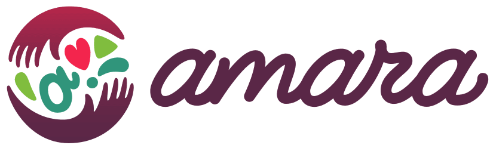

#  Amara

Manage video subtitles, captions, and translations on the Amara platform. Add and manage videos from YouTube, Vimeo, or direct URLs. Create, upload, download, and edit subtitles in multiple formats (DFXP, SRT, VTT, SSA, SBV) across any supported language. Perform subtitle workflow actions including saving drafts, publishing, approving, and rejecting. Add notes to subtitle sets for collaborator communication. Manage teams with configurable membership policies and role-based access control. Organize videos into projects, handle team membership applications, and configure team language preferences. Track and manage multi-stage subtitle requests with assignees and due dates across collaborating teams. View activity logs for videos, teams, and users. Create and manage user accounts, send messages to users or teams, and retrieve supported languages.

## License

This integration is licensed under the [FSL-1.1](https://github.com/metorial/metorial-platform/blob/dev/LICENSE).

  Built with ❤️ by <a href="https://metorial.com">Metorial</a>

