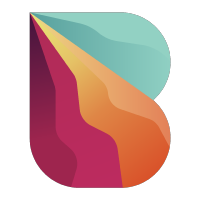

#  Bitquery

Query real-time and historical blockchain data across 40+ networks including Ethereum, Bitcoin, Solana, and Polygon using a unified GraphQL API. Retrieve DEX trades, token prices, OHLCV candle data, token transfers, wallet balances, NFT ownership and metadata, smart contract events and calls, mempool pending transactions, and liquidity pool data. Trace money flows across addresses and chains for compliance and forensic analysis using Coinpath®. Analyze token holder distributions, top holders, and distribution metrics. Subscribe to real-time streaming data via WebSocket or Kafka for DEX trades, transfers, blocks, transactions, smart contract events, and NFT activity.

## License

This integration is licensed under the [FSL-1.1](https://github.com/metorial/metorial-platform/blob/dev/LICENSE).

  Built with ❤️ by <a href="https://metorial.com">Metorial</a>

