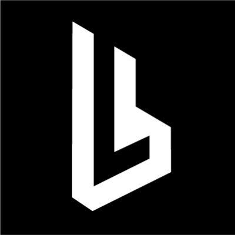

#  Browserless

Automate headless Chrome/Chromium browsers in the cloud for web scraping, content extraction, and browser automation tasks. Scrape pages with CSS selectors, Smart Scrape cascading strategies, URL mapping, asynchronous crawls, rendered HTML retrieval, web search, Lighthouse audits, and custom Puppeteer functions. Generate PDFs, screenshots, URL exports, and browser-triggered downloads with file bytes returned through Slate attachments. Unblock protected pages with optional content, cookies, screenshot attachments, and Browserless WebSocket handoff metadata. BrowserQL and BaaS session management remain separate long-lived browser control surfaces and are not exposed as REST tools in this integration.

## License

This integration is licensed under the [FSL-1.1](https://github.com/metorial/metorial-platform/blob/dev/LICENSE).

  Built with ❤️ by <a href="https://metorial.com">Metorial</a>

