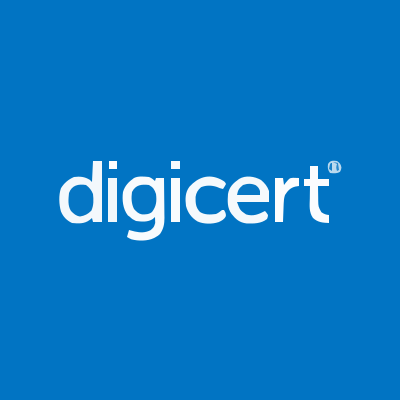

#  Digicert

Order, issue, renew, reissue, and revoke TLS/SSL certificates, code signing certificates, document signing certificates, and client certificates. Manage domains and perform domain control validation (DCV) using email, DNS CNAME, DNS TXT, or HTTP methods. Manage organizations and submit them for OV, EV, and code signing validation. Automate certificate enrollment and installation across devices using agent-based or agentless automation. Discover internal and public-facing certificates across your network. Manage private CA hierarchies and issue X.509 certificates via private PKI. Sign code and software artifacts securely through Software Trust Manager. Provision IoT devices, manage device groups, enroll device certificates, and handle firmware updates. Generate custom reports on certificate orders, domains, and organizations using GraphQL. Receive webhook notifications for certificate issuance, revocation, order rejection, and domain/organization validation events and expiry warnings.

## License

This integration is licensed under the [FSL-1.1](https://github.com/metorial/metorial-platform/blob/dev/LICENSE).

  Built with ❤️ by <a href="https://metorial.com">Metorial</a>

