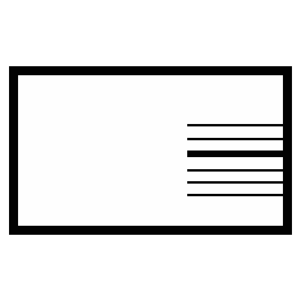

#  Echtpost

Send real physical postcards programmatically through the German EchtPost platform. Create and schedule postcard deliveries using pre-designed templates, manage recipient contacts and groups, and list available postcard templates. Supports scheduling delivery dates, configuring email notifications for send events, specifying recipients inline or by contact/group ID, and sending bulk postcards to recipient groups. Requires a prepaid account balance for sending.

## License

This integration is licensed under the [FSL-1.1](https://github.com/metorial/metorial-platform/blob/dev/LICENSE).

  Built with ❤️ by <a href="https://metorial.com">Metorial</a>

