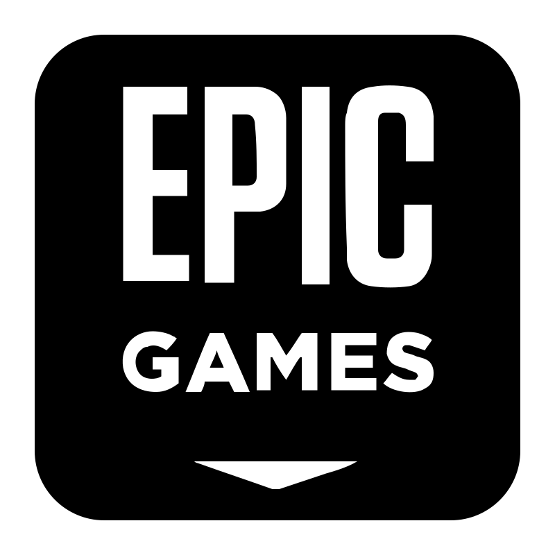

#  Epic Games

Use Epic’s developer services to resolve cross-platform player identities, inspect application-consented Epic accounts, query sanctions and player reports, verify ownership and entitlements, inspect anti-cheat policy, and manage sanctions or voice participants. These actions require an authorized developer application and its native client policies; they do not control the consumer launcher or arbitrary games.

Epic Account OAuth and EOS Game Services client credentials are separate connection types. `get_connection_context` verifies an account token or shows game-service metadata observed at its token grant. Configure an optional deployment through authentication; use explicit sandbox inputs for ecommerce. Native token expiry and renewal are retained.

Friends retains an existing HTTP compatibility route. Current official documentation corroborates the SDK feature, but this HTTP contract has not been verified live. No endpoint retirement is claimed.

Reports, sanctions and redemption can have retained or irreversible effects. Voice tokens must go only to their corresponding players; token issuance does not prove they joined. Participant batches expose partial acceptance and perform no rollback.

## License

This integration is licensed under the [FSL-1.1](https://github.com/metorial/metorial-platform/blob/dev/LICENSE).
