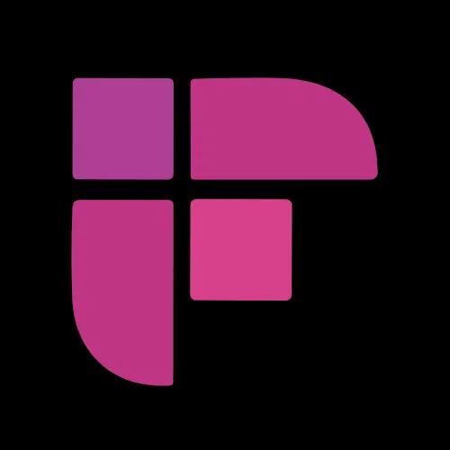

#  Fireflies

Record, transcribe, and analyze meeting conversations from platforms like Zoom, Google Meet, and Webex. Retrieve, search, and manage meeting transcripts with AI-generated summaries, action items, sentiment analysis, and keywords. Upload audio files for transcription. Ask questions about meetings using the AskFred AI assistant. Add a bot to live meetings for automatic recording, pause and resume recordings, and create live action items or soundbites. Manage users and teams, organize meetings into channels, query contacts, and receive webhook notifications when transcriptions complete.

## License

This integration is licensed under the [FSL-1.1](https://github.com/metorial/metorial-platform/blob/dev/LICENSE).

  Built with ❤️ by <a href="https://metorial.com">Metorial</a>

