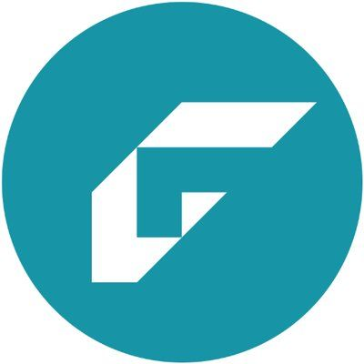

#  Gagelist

Manage gages (measurement equipment), calibration records, and compliance tracking for quality standards such as ISO 9001, ISO 17025, AS 9100, and 21 CFR Parts 11/820. Create, read, update, and delete gage records and calibration records. Upload and manage file attachments on gages and calibrations. Generate calibration certificates. Manage manufacturer entries. Read and update custom field values for organization-specific data. Retrieve and update account settings. Export data for business intelligence and reporting purposes.

## License

This integration is licensed under the [FSL-1.1](https://github.com/metorial/metorial-platform/blob/dev/LICENSE).

  Built with ❤️ by <a href="https://metorial.com">Metorial</a>

