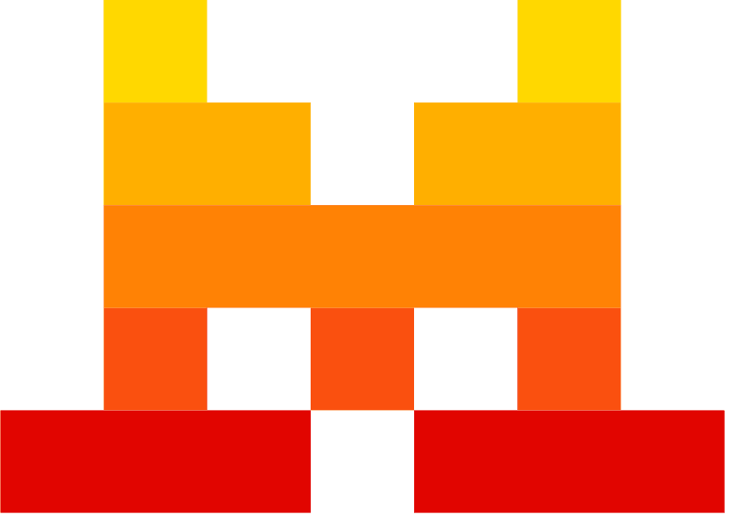

#  Mistral Ai

Generate chat completions, embeddings, and structured outputs using Mistral AI's language models. Process documents with OCR to extract text, tables, and images from PDFs. Transcribe audio with speaker diarization. Generate code with specialized coding models. Create and manage AI agents with built-in connectors for code execution, web search, image generation, and document retrieval. Moderate content for safety across multiple languages. Fine-tune models by uploading training data and managing fine-tuning jobs. Generate text embeddings for semantic search and RAG. Perform batch inference for async bulk processing. Manage files and list available models.

## License

This integration is licensed under the [FSL-1.1](https://github.com/metorial/metorial-platform/blob/dev/LICENSE).

  Built with ❤️ by <a href="https://metorial.com">Metorial</a>

