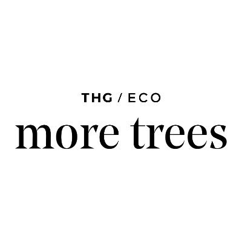

#  More Trees

Plant trees and purchase carbon credits through global reforestation projects. Retrieve account details, credit balances, and forest statistics including trees planted and CO2 captured. Browse active projects and available tree types, plant trees for yourself or gift them to others by email or account code, and track cumulative carbon offset figures.

## License

This integration is licensed under the [FSL-1.1](https://github.com/metorial/metorial-platform/blob/dev/LICENSE).

  Built with ❤️ by <a href="https://metorial.com">Metorial</a>

