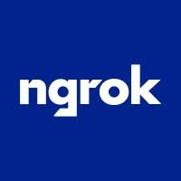

#  Ngrok

Manage ngrok's globally distributed gateway for secure application connectivity. Create and manage endpoints, tunnels, and traffic routing. Reserve custom domains and TCP addresses for exposing services. Manage TLS certificates, SSH credentials, and certificate authorities for secure connections. Configure IP policies to restrict access with allow/deny CIDR rules. Manage API keys, tunnel authtokens, and bot service accounts. Set up event subscriptions to export audit and traffic logs to destinations like AWS CloudWatch, Kinesis, Firehose, Azure Logs Ingestion, and Datadog. Manage secrets and vaults for sensitive configuration data.

## License

This integration is licensed under the [FSL-1.1](https://github.com/metorial/metorial-platform/blob/dev/LICENSE).

  Built with ❤️ by <a href="https://metorial.com">Metorial</a>

