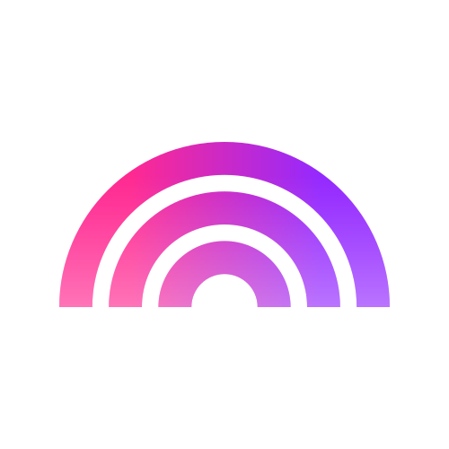

#  Plasmic

Render Plasmic-designed pages and components as HTML, access project models, and manage CMS content. Render components in preview, published, or versioned modes with customizable props and variants. Retrieve full project structures including components, pages, design tokens, and metadata. Programmatically create and update components, pages, and design tokens. Perform full CRUD operations on headless CMS content: query, count, create, update, delete, and publish items with filtering and localization support. Configure webhooks for project and CMS publish events.

## License

This integration is licensed under the [FSL-1.1](https://github.com/metorial/metorial-platform/blob/dev/LICENSE).

  Built with ❤️ by <a href="https://metorial.com">Metorial</a>

