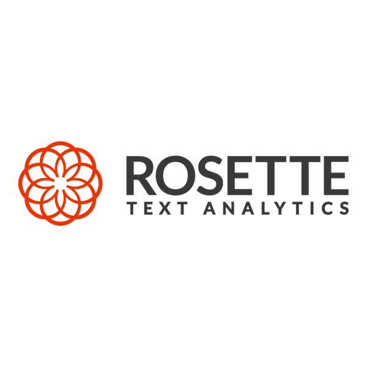

#  Rosette Text Analytics

Analyze unstructured and semi-structured text using natural language processing across Asian, European, and Middle Eastern languages. Extract entities (persons, locations, organizations, products) and link them to knowledge bases like Wikidata and DBpedia. Determine sentiment at document or entity level. Compare and match names across languages accounting for transliterations, nicknames, and spelling variations. Translate names between 13+ languages. Deduplicate name lists across scripts. Compare address and record similarity. Extract relationships and events connecting entities. Categorize documents by topic using IAB taxonomy. Discover keyphrases and concepts via topic extraction. Perform morphological analysis including part-of-speech tagging, lemmatization, and compound decomposition. Tokenize text, detect sentences, identify languages (55 supported), compute semantic similarity via text embeddings, parse syntactic dependencies, and transliterate text between scripts.

## License

This integration is licensed under the [FSL-1.1](https://github.com/metorial/metorial-platform/blob/dev/LICENSE).

  Built with ❤️ by <a href="https://metorial.com">Metorial</a>

