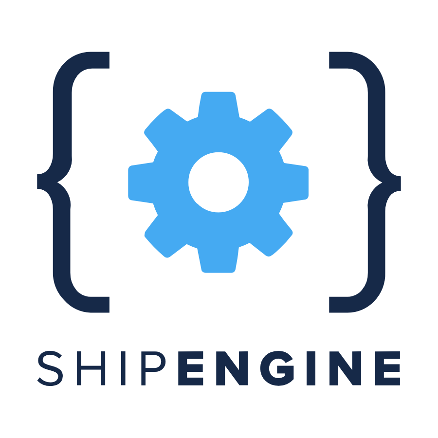

#  ShipEngine

Validate addresses, compare carrier rates, purchase and void shipping labels, track packages, manage shipments and warehouses, discover carrier services, find service points, schedule pickups, create manifests, and download existing shipping documents.

ShipEngine is now ShipStation API; existing API hosts remain supported. Production label purchases and pickups can incur charges. Cancellation and void operations retain provider history, and refund completion follows carrier policy.

## License

This integration is licensed under the [FSL-1.1](https://github.com/metorial/metorial-platform/blob/dev/LICENSE).

  Built with ❤️ by <a href="https://metorial.com">Metorial</a>

