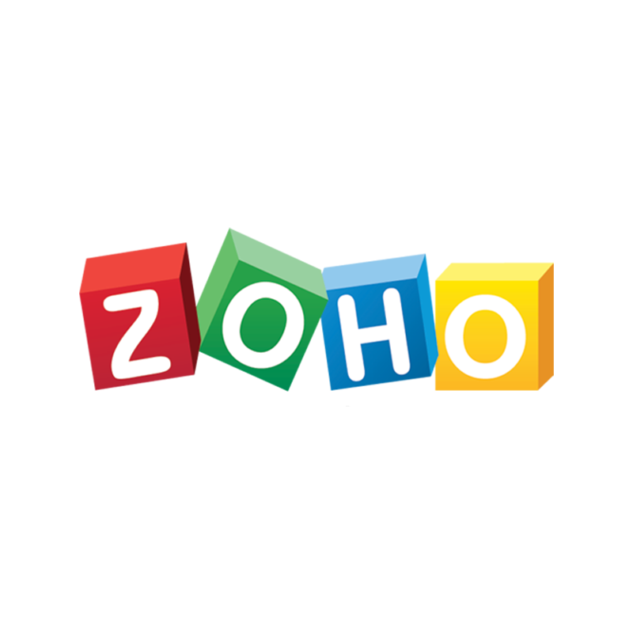

#  Zoho

Manage core Zoho workflows across CRM, Desk, Books, People, and Projects with one OAuth connection. Retrieve, search, create, update, delete, and inspect related CRM records; manage Desk tickets and contacts; work with Books organizations, invoices, contacts, and expenses; list People forms and manage form/employee, leave, and attendance data; and discover Projects portals while managing projects, tasks, and milestones.

OAuth accepts the customer's own regular regional or Multi-DC server application. Choose the application type when connecting: regional applications also require their registered region, while Multi-DC applications may optionally constrain the expected account region. The validated callback Accounts origin determines the persisted region, token exchange, and refresh routing; the validated token-response API domain is used for generic product APIs.

The included Projects tools use Projects V3 through the validated OAuth API domain. Project and task status mutations require V3 status IDs, and project/task owner inputs now require ZPUIDs rather than legacy user IDs or ZUIDs. The legacy project `template` list filter and milestone `completed`/`notcompleted` filters have no verified V3 equivalents. See the [Projects V3 migration contract](docs/PROJECTS_V3_MIGRATION.md) for compatibility details and the live release gate.

## License

This integration is licensed under the [FSL-1.1](https://github.com/metorial/metorial-platform/blob/dev/LICENSE).

  Built with ❤️ by <a href="https://metorial.com">Metorial</a>

