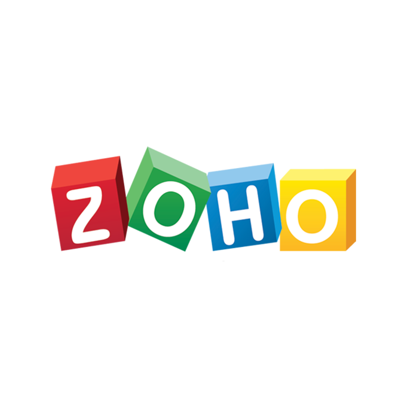

#  Zoho

Manage Zoho CRM, Bigin, Books, Inventory, Invoice, Desk, Mail, People, and Projects with one OAuth connection. Tools use product prefixes such as `crm_`, `bigin_`, `books_`, and `mail_` so workflows remain easy to distinguish.

All tools from the individual product integrations are available here. Existing Zoho tool keys remain supported. Where their input contracts differ, the imported CRM record/search/related-list tools use `crm_api_` and the imported Desk contact tool uses `desk_api_manage_contact`.

Call `books_list_organizations`, `inventory_list_organizations`, `invoice_list_organizations`, or `desk_list_organizations` before organization-scoped operations. Pass the selected `organizationId` or `orgId` into subsequent tools. Use `mail_get_account_info` for Mail account IDs, `inventory_list_locations` for inventory locations, and `projects_get_portals` for Projects portal IDs.

Reconnect existing OAuth connections to grant access to newly added product scopes. Product availability, subscription plans, and permissions still depend on the connected Zoho account.

OAuth accepts the customer's own regular regional or Multi-DC server application. Choose the application type when connecting: regional applications also require their registered region, while Multi-DC applications may optionally constrain the expected account region. The validated callback Accounts origin determines the persisted region, token exchange, and refresh routing; the validated token-response API domain is used for generic product APIs.

The included Projects tools use Projects V3 through the regional Projects API origin. Project and task status mutations require V3 status IDs, and project/task owner inputs now require ZPUIDs rather than legacy user IDs or ZUIDs. The legacy project `template` list filter and milestone `completed`/`notcompleted` filters have no verified V3 equivalents. See the [Projects V3 migration contract](docs/PROJECTS_V3_MIGRATION.md) for compatibility details and the live release gate.

This integration provides tools only. CRM and Desk event triggers have been removed.

## License

This integration is licensed under the [FSL-1.1](https://github.com/metorial/metorial-platform/blob/dev/LICENSE).

  Built with ❤️ by <a href="https://metorial.com">Metorial</a>

